<!-- ===================== BANNER ===================== -->
<p align="center">
  
</p>

<!-- ===================== TYPING ANIMATION ===================== -->
<div align="center">

[](https://github.com/kevinrisqi)

<!-- Profile views + followers -->

<a href="https://github.com/kevinrisqi?tab=followers"></a>

</div>

<!-- ===================== ABOUT ===================== -->
## 👋 About Me

```dart
class Developer {
  final String name = "Kevin Risqi";
  final String role = "Mobile Developer";
  final String location = "Indonesia 🇮🇩";
  final List<String> focus = ["Flutter", "Dart", "Cross-platform apps"];
  final List<String> learning = ["Advanced Dart", "Clean Architecture", "State Management"];

  void sayHi() => print("Thanks for visiting — let's build something great! 🚀");
}
```

- 🔭 &nbsp;Currently building **cross-platform mobile apps** with Flutter & Dart
- 🌱 &nbsp;Deepening my skills in **state management (GetX)** & clean architecture
- 👯 &nbsp;Open to **collaborating on mobile app projects**
- 💬 &nbsp;Ask me about **Flutter, React, Node.js & Laravel**
- ⚡ &nbsp;Fun fact: I enjoy turning ideas into shippable apps

<!-- ===================== CONNECT ===================== -->
## 🌐 Connect With Me

<p align="left">
  <a href="mailto:kevinrisqi22@gmail.com"></a>
  <a href="https://www.linkedin.com/in/kevin-risqi/"></a>
  <a href="https://www.instagram.com/garapintech/"></a>
</p>

<!-- ===================== TECH STACK ===================== -->
## 🛠️ Tech Stack

<div align="center">

#### Mobile


#### Frontend


#### Backend & Database


#### Tools


</div>

<!-- ===================== GITHUB STATS ===================== -->
## 📊 GitHub Stats

<div align="center">


</div>

<div align="center">


</div>

<!-- ===================== TROPHIES ===================== -->
## 🏆 GitHub Trophies

<div align="center">


</div>

<!-- ===================== SNAKE ANIMATION ===================== -->
## 🐍 Contribution Snake

<div align="center">

<picture>
  <source media="(prefers-color-scheme: dark)" srcset="https://raw.githubusercontent.com/kevinrisqi/kevinrisqi/output/github-contribution-grid-snake-dark.svg" />
  <source media="(prefers-color-scheme: light)" srcset="https://raw.githubusercontent.com/kevinrisqi/kevinrisqi/output/github-contribution-grid-snake.svg" />
  
</picture>

</div>

<!-- ===================== FOOTER ===================== -->


<div align="center">
  <i>⭐️ From <a href="https://github.com/kevinrisqi">kevinrisqi</a></i>
</div>
